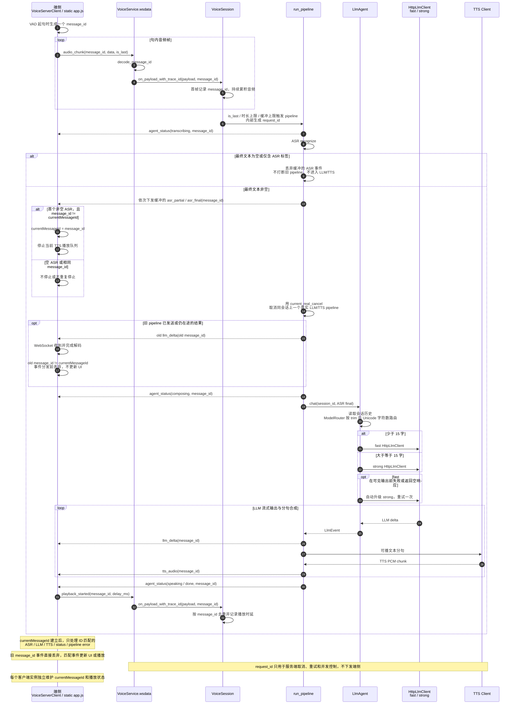

# voice-ai

终端语音 → 服务端 ASR → LLM → TTS → 回放的完整链路，端到端跑通。

## 当前语音对话流程

下面的流程图按当前代码实现整理，主入口是浏览器或 Electron 端连接
`/ws/voice/web/{session_id}` 后发送 `audio_chunk`。



控制消息的当前行为：`Interrupt` 取消当前会话的所有 pipeline 并清理端侧播放；
`Retry` 重放最近一次有效音频并复用原 `message_id`，服务端只生成新的内部
`request_id`；`SessionEnd` 关闭会话并取消未完成任务。

## 项目结构

```
voice-ai/
├── Cargo.toml                            # workspace
├── README.md
└── crates/
    ├── voice-proto/                      # VoicePayload 协议 + 编解码
    │   ├── Cargo.toml
    │   └── src/lib.rs
    ├── voice_server/                     # 服务端（基于 webhttp）
    │   ├── Cargo.toml
    │   └── src/
    │       ├── lib.rs
    │       ├── client/                   # ASR / LLM / TTS client 与协议实现
    │       ├── session/                  # VoiceSession 状态机与完整流水线
    │       ├── pipeline/                 # LLM → TTS 增量处理与音频拼接
    │       ├── agent/                    # Agent 记忆、模型路由与搜索边界
    │       ├── service.rs                # VoiceService 实现
    │       ├── config/                   # YAML 配置与模板
    │       └── bin/voice_server.rs       # 启动入口
    └── ws_payload_helper/                # MessagePack 调试辅助工具
└── voice_desktop/                        # Electron + React 桌面端（独立 npm 项目）
```

> 注：终端 CLI 已停用，当前主线是浏览器页面和 Electron 桌面端。

## 构建和启动

### 1. 构建服务端

在项目根目录执行：

```bash
cargo build --release -p voice_server
```

生成的可执行文件为 `target/release/voice_server`。

### 2. 配置并启动 voice_server

默认配置文件是 `crates/voice_server/src/config/config.yaml`。生产环境建议复制一份到项目外部，并通过 `--config` 显式指定，避免把密钥写进仓库：

```bash
# 使用自定义配置文件
cargo run --release -p voice_server -- --config /absolute/path/to/voice-voice_server.yaml

# 或直接使用仓库内的默认配置
RUST_LOG=info cargo run --release -p voice_server

# 默认监听 8080；可用环境变量覆盖：
# HTTP_PORT=9000
# VOICE_PROVIDER_API_BASE=https://...
# VOICE_PROVIDER_API_KEY=sk-xxx
# VOICE_ASR_API_KEY=sk-xxx
# VOICE_LLM_API_BASE=https://...
# VOICE_LLM_API_KEY=sk-xxx
# VOICE_LLM_TIMEOUT_MS=30000
# VOICE_LLM_HEADERS='{"X-Tenant":"tenant-a"}'
# VOICE_TTS_API_KEY=sk-xxx
# VOICE_ASR_MODEL=model-name
# VOICE_LLM_MODEL=model-name
# VOICE_LLM_MAX_COMPLETION_TOKENS=512
# VOICE_LLM_TEMPERATURE=0.7
# VOICE_LLM_TOP_P=0.9
# VOICE_LLM_TOP_K=20
# VOICE_LLM_REASONING_EFFORT=low
# VOICE_LLM_INCLUDE_USAGE=true
# VOICE_LLM_STRONG_MODEL=Qwen/Qwen3-30B-A3B
# VOICE_LLM_STRONG_TIMEOUT_MS=180000
# VOICE_LLM_STRONG_TOP_K=20
# VOICE_TTS_MODEL=model-name
# VOICE_TTS_VOICE=vivian
# VOICE_TTS_SAMPLE_RATE=24000
```

LLM 使用两个独立配置：`llm` 是 fast，`llm_strong` 是 strong。首版路由只计算 ASR final 执行 `trim()` 后的 Unicode 字符数：少于 15 字走 fast，达到或超过 15 字走 strong。两份完整 System Prompt 位于 `crates/voice_server/src/client/prompt.yaml`，分别在两个 `HttpLlmClient` 构造时固定，`LlmAgent` 不读取或拼接 Prompt。

fast 请求不注册工具，当前 strong 也未实现 `tools` / `tool_calls` 执行协议。未配置 `llm_strong` 时，strong 路由复用 fast 的模型连接参数，但仍使用 strong Prompt。

启动后检查服务：

```bash
curl http://127.0.0.1:8080/health
```

语音链路统计页面：`http://127.0.0.1:8080/metrics-dashboard.html`。

### 3. 浏览器端到端页面

打开：

```text
http://127.0.0.1:8080
```

浏览器页面会通过 WebSocket 连接 `ws://127.0.0.1:8080/ws/voice/web/admin`。需要浏览器允许麦克风权限，并且配置中的 ASR、LLM、TTS 服务可访问。

### 4. Electron 桌面端

桌面端不会启动或打包服务端，需要先启动上面的 `voice_server`，然后在 `voice_desktop` 目录执行：

```bash
cd voice_desktop
npm install

# 开发模式：两个终端分别运行
npm run dev
npm run electron
```

启动 Electron 后，在设置中填写远程服务端地址，例如 `http://127.0.0.1:8080`。生产构建和 macOS 安装包：

```bash
npm run typecheck
npm test
npm run build
npm run package:mac
```

安装包输出到 `voice_desktop/release/`。

打断：浏览器前端「打断」按钮会发送 WS `Interrupt` 并清空本地 TTS 队列。
跨句自动打断由新问句第一条 `trim()` 后非空的 `asr_partial` 或 `asr_final`
触发：端侧更新 `currentMessageId` 并停止播放，但不发送 `Interrupt`；服务端在新 pipeline
获得非空 ASR 文本后，通过 `current_real_cancel` 取消上一条已经进入 LLM/TTS 的 pipeline。
