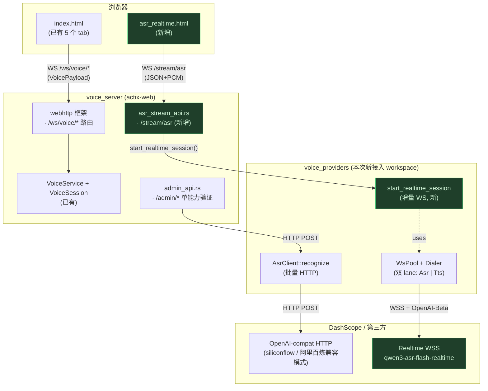
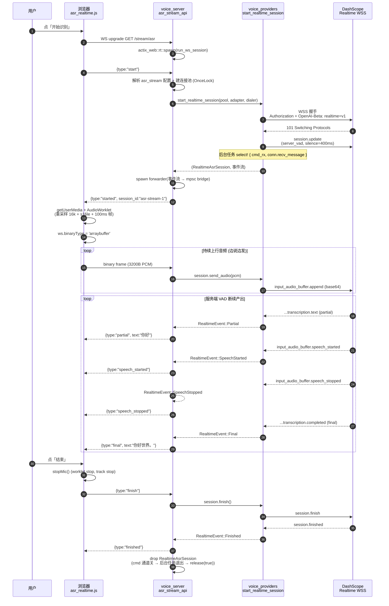
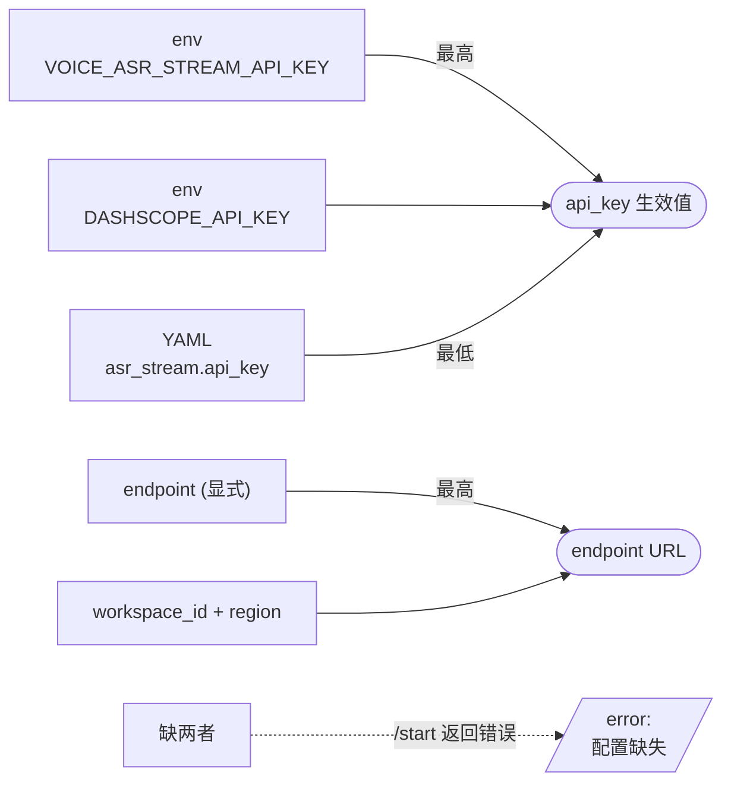

# voice-app 业务流程图（含新增 `/stream/asr`）

> 三张聚焦图：①架构总览 ②新建 `/stream/asr` 时序 ③WS 协议生命周期

## ① 架构总览：新增路径 vs 既有路径



**关键事实**：
- 新旧两条路径完全独立，共享进程但不共享任何代码路径
- 既有路径走 `webhttp::start` 的 `/ws/{business}/{actor}/{connid}` 路由
- 新路径走 actix-web 自定义 scope `/stream/asr`，**绕过 webhttp 的 WS 协议**（避免 VoicePayload 包袱）
- voice-providers 是首次接入 voice_server

---

## ② 新流程时序：`/stream/asr` 完整生命周期（happy path）



**关键差异点**（vs 公共协议 session.rs）：
- 事件流**不**在首个 final 断流；多句连续听写收完所有句才到 `session.finished`
- `select!` 走 `conn.recv_message()`（文本帧），不是 `recv_frame()`（GAX 解码路径）

---

## ③ WS 协议生命周期（消息→状态→出口）

```mermaid
flowchart TD
    Start([浏览器上行<br/>{type:'start'}]) --> Idle{provider<br/>会话?}
    Idle -- 存在 --> ErrBusy[/"error: 会话进行中<br/>先 stop"/]
    Idle -- 不存在 --> Dial[acquire_or_dial<br/>Asr lane]
    Dial -->|Handshake 失败| ErrHandshake[/"error: 连接失败<br/>(Auth/网络)"/]
    Dial --> Open[send session.update]
    Open --> Forward[spawn forwarder + select! 循环]
    Forward --> Started[/"started<br/>session_id"/]
    Started --> Loop{浏览器<br/>上行}
    Loop -- "binary PCM" --> SendAudio[send_audio →<br/>按 3200B 切片<br/>input_audio_buffer.append]
    SendAudio --> Loop
    Loop -- "finish" --> Finish[session.finish →<br/>session.finished]
    Finish --> Loop
    Loop -- "stop" --> Abandon[drop session →<br/>abandon → 连接归还]
    Abandon --> Stopped[/"stopped"/]
    Stopped --> Done

    Forward -.服务端 VAD 边沿.-> Vad[/"speech_started<br/>speech_stopped"/]
    Forward -.每句识别.-> Trans[/"partial / final"/]
    Finish -.session.finished.-> Finished[/"finished"/]
    Vad --> Loop
    Trans --> Loop
    Finished --> Done([流结束])

    classDef okEvent fill:#1f3a5f,stroke:#4a8ed8,color:#d2e7fa
    classDef errEvent fill:#4a1f1f,stroke:#f87171,color:#fad2d2
    class Started,Started,Vad,Trans,Finished okEvent
    class ErrBusy,ErrHandshake,Stopped errEvent
```

**协议消息清单**：

| 方向 | type | 触发方 | 浏览器发送时机 | 浏览器响应动作 |
|---|---|---|---|---|
| ↑ | start | 浏览器 | 点开始 | 等 started / error |
| ↑ | binary | 浏览器 | worklet 每 100ms | 静默（无下行 binary） |
| ↑ | finish | 浏览器 | 点结束 | 等剩余事件 + finished |
| ↑ | stop | 浏览器 | 点放弃 / 关闭页 | stopped |
| ↓ | started | 服务端 | — | 启动麦克风 + worklet |
| ↓ | partial | 服务端 | — | 替换增量行 |
| ↓ | final | 服务端 | — | 追加为已完成行 + 清增量行 |
| ↓ | speech_started/stopped | 服务端 | — | VAD 徽标 |
| ↓ | finished | 服务端 | — | 复位所有按钮 / 状态 |
| ↓ | error | 服务端 | — | 红色显示 + 复位 |

---

## ④ 新旧两条路径对比

| 维度 | 既有 `/admin/asr` | 既有 `/ws/voice/*` | **新增 `/stream/asr`** |
|---|---|---|---|
| 入口 | HTTP POST + wav 文件 | WS + VoicePayload | **独立 WS + JSON/binary** |
| 处理路径 | `admin_api::asr` → `AsrClient::recognize` | `VoiceService::wsdata` → `VoiceSession` | **`asr_stream_api::ws_asr_stream` → `start_realtime_session`** |
| ASR 模型 | siliconflow SenseVoice | (走 session pipeline 默认) | **qwen3-asr-flash-realtime** |
| ASR 协议 | HTTP multipart 单次返回 | (session 内组合) | **WebSocket Realtime 全双工** |
| 实时性 | 一次性（上传完再等结果） | 边收边发 + 完整 pipeline | **边说边出 partial / final** |
| 断句方式 | 客户端按文件句尾 | 客户端 VAD + 服务端兜底 | **服务端 VAD（turn_detection）** |
| 影响既有功能 | — | — | **零影响（独立 scope）** |
| 页面 | index.html 旧 tab | index.html 全流程 tab | **独立 /asr_realtime.html** |

---

## 配置优先级速查

