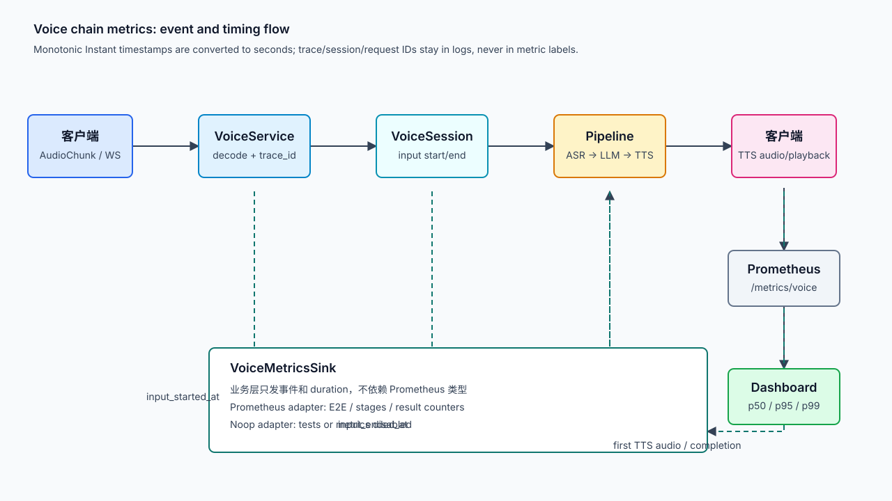

# Voice Chain Metrics Implementation Plan

> **For agentic workers:** REQUIRED SUB-SKILL: Use superpowers:subagent-driven-development (recommended) or superpowers:executing-plans to implement this plan task-by-task. Steps use checkbox (`- [ ]`) syntax for tracking.

**Goal:** 将语音客户端到 Server、ASR、LLM、TTS 以及客户端播放相关的可观测时间点和结果，落成低基数指标，并让 Prometheus 作为可替换的默认导出实现。

**Architecture:** 业务代码只依赖 `Arc<dyn VoiceMetricsSink>`，由 sink 接收阶段事件和耗时；默认实现 `PrometheusMetricsSink` 内部使用独立 Registry，并通过 `/metrics/voice` 暴露，避免和 `webhttp` 已有的 `/metrics` 注册表冲突。`VoiceSession` 记录输入起止时间，`run_pipeline` 记录各阶段时间点；Prometheus adapter 内部使用 RAII guard 保证异常 return、取消和 panic 路径至少产生结果计数与 pipeline 总耗时。trace/session/request 只写入结构化日志和 span，不进入指标标签。

**Tech Stack:** Rust, Tokio, Actix Web, `prometheus` crate, `tracing`, existing `VoiceSession`/`llm_tts_items` pipeline, TypeScript/browser WebSocket clients.

**Spec:** `docs/superpowers/specs/2026-09-01-voice-chain-metrics-spec.md`; architecture decision: `docs/superpowers/specs/2026-09-01-voice-metrics-collection-architecture.md`

## Global Constraints

- 延迟 Histogram 单位统一为秒，使用服务端 `Instant` 计算，避免跨机器墙钟偏差。
- 指标标签只允许低基数维度；禁止 `trace_id`、`message_id`、`session_id`、`request_id`、prompt 和文本内容。
- 主 SLI 为 `voice_e2e_utterance_end_to_tts_first_audio_seconds`。
- 不把“trace 是否完整”等链路完整性指标纳入本期实现。
- 保留 `webhttp` 自带 `/metrics`，自定义指标使用 `/metrics/voice`。
- `VoiceSession`、pipeline 和 TTS client 不得直接依赖 Prometheus 类型，只依赖 `VoiceMetricsSink`。
- 每个任务都先写失败测试，再写最小实现，测试通过后再进入下一任务。

## Review Diagram



图中实线表示业务消息流，绿色虚线表示时间点向 `VoiceMetrics` 汇聚，Prometheus 只拉取聚合结果。

## File Map

- Create: `crates/voice_server/src/metrics.rs`：`VoiceMetricsSink`、`PipelineResult`、`NoopMetricsSink`、Prometheus adapter、Registry、Histogram/Counter、pipeline RAII guard 和 Actix handler。
- Modify: `crates/voice_server/src/lib.rs`：注册并导出 `metrics` 模块。
- Modify: `crates/voice_server/src/service.rs`：创建共享 `Arc<dyn VoiceMetricsSink>`，注入应用数据，挂载 `/metrics/voice`，通过 `new_with_metrics` 注入 session。
- Modify: `crates/voice_server/src/session/mod.rs`：记录首个音频 chunk 和最后一个 chunk 的 `Instant`，把时间点和共享 metrics 传给 pipeline。
- Modify: `crates/voice_server/src/session/pipeline.rs`：记录队列、ASR、LLM、TTS、首包和完成时间，给取消/超时/Provider 错误设置结果类型。
- Modify: `crates/voice_server/src/client/tts_ws.rs`：把已有 TTS WS 事件时间点抽成可复用的 metrics hook，补充连接/错误/音频统计。
- Modify: `crates/voice_server/src/bin/voice_server.rs`：启动日志同时打印 `/metrics/voice` 地址。
- Modify: `docs/superpowers/specs/2026-09-01-voice-chain-metrics-spec.md`：记录已实现项、暂未实现的客户端播放时间点和 TTS 精确时间点来源。
- Create: `docs/superpowers/specs/2026-09-01-voice-metrics-collection-architecture.md`：记录采集架构、解耦边界和 Prometheus/OpenTelemetry 演进路径。
- Test: `crates/voice_server/src/metrics.rs` 内单元测试，以及 `session/pipeline.rs` 的 mock pipeline 指标断言。

## Metric Contract

### Core Histograms

```text
voice_e2e_input_to_tts_first_audio_seconds
voice_e2e_utterance_end_to_tts_first_audio_seconds
voice_e2e_input_to_tts_complete_seconds
voice_e2e_utterance_end_to_tts_complete_seconds
voice_e2e_tts_first_audio_to_client_playback_seconds  # 客户端上报协议完成后再启用
```

### Stage Histograms

```text
voice_pipeline_queue_duration_seconds
voice_asr_duration_seconds
voice_llm_time_to_first_token_seconds
voice_llm_duration_seconds
voice_tts_input_wait_seconds             # 需要 TTS WS input.text/input.done hook
voice_tts_time_to_first_audio_seconds
voice_tts_generation_duration_seconds
voice_pipeline_duration_seconds
```

### Counters

```text
voice_requests_total
voice_requests_success_total
voice_requests_failed_total
voice_requests_timeout_total
voice_requests_cancelled_total
voice_requests_retried_total
voice_tts_ws_connect_total
voice_tts_ws_connect_failed_total
voice_tts_ws_reconnect_total
voice_tts_provider_errors_total
```

错误阶段和类型只使用固定集合：`connect|send_input|receive|asr|llm|tts|playback` 与 `timeout|provider|decode|connection_closed|empty_response|cancelled`。

### Timing Ownership

| 时间点 | 记录位置 | 备注 |
|---|---|---|
| `input_started_at` | `VoiceSession::AudioChunk` 首帧 | 每个 utterance 只记一次 |
| `input_ended_at` | `VoiceSession::trigger_pipeline` | `is_last`、时长上限或 buffer 上限触发时统一取值 |
| `asr_started_at` | `run_pipeline` 调用 ASR 前 | 同时计算队列等待 |
| `asr_final_at` | ASR final event | 记录 ASR duration |
| `llm_started_at` | 创建 `llm_tts_items` 前 | LLM 流开始基准 |
| `llm_first_token_at` | 首个非空 LLM delta | 只记录一次 |
| `llm_completed_at` | `LlmTtsItem::Llm { is_final: true }` | 只记录一次 |
| `tts_first_audio_at` | 首个非空 TTS audio item | 记录 E2E 和 TTS 首包 |
| `tts_completed_at` | `Tts { is_last: true }` 或流结束 | 记录完成类指标 |
| `client_audio_started_at` | 客户端播放器实际开始播放事件 | 本期先定义协议，不由服务端猜测 |

TTS 的 `input.text`、`input.done`、`session.done` 精确时间点必须从 `llm_tts_items`/`TtsWsClient` 暴露 callback 或事件结构后再计算 `voice_tts_input_wait_seconds` 和精确的 `voice_tts_time_to_first_audio_seconds`；在此之前，Server 只记录现有 pipeline 能可靠观测到的首个音频区间，并在 help 文本和日志中标明口径。

## Implementation Tasks

### Task 1: Define metrics registry and handler

**Files:**
- Create: `crates/voice_server/src/metrics.rs`
- Modify: `crates/voice_server/src/lib.rs`
- Test: `crates/voice_server/src/metrics.rs`

**Interfaces:**
- Produces `pub trait VoiceMetricsSink: Send + Sync` and `pub enum PipelineResult`.
- Produces `PrometheusMetricsSink::new() -> PrometheusMetricsSink` and `NoopMetricsSink`.
- Produces `Arc<dyn VoiceMetricsSink>::start_pipeline(input_started_at: Instant, input_ended_at: Instant) -> PipelineMetricsGuard`.
- Produces `metrics::handler(web::Data<Arc<PrometheusMetricsSink>>) -> HttpResponse`.

- [ ] **Step 1: Write the failing test**

Add a unit test that starts a guard, records first audio and success completion, drops it, then asserts the rendered text contains the two E2E histograms, `voice_requests_total`, `voice_requests_success_total`, and no `session_id` label.

- [ ] **Step 2: Run test to verify it fails**

Run: `cargo test -p voice_server --lib metrics::tests::renders_pipeline_metrics_without_high_cardinality_labels`

Expected: FAIL before `metrics.rs` and collectors exist.

- [ ] **Step 3: Implement the minimal registry**

Define the trait and `PipelineResult` first. Implement `PrometheusMetricsSink` with one private `prometheus::Registry`; register collectors with fixed names. Keep `PipelineMetricsGuard` internal to the adapter: its `Drop` always observes `voice_pipeline_duration_seconds` and increments exactly one result counter. `finish(result, at)` must be idempotent and record the two completion histograms once. `record_first_audio(at)` must be idempotent and record both first-audio histograms once. Add a no-op implementation for tests and deployments that disable metrics.

- [ ] **Step 4: Run the focused test**

Run the command from Step 2.

Expected: PASS.

- [ ] **Step 5: Commit**

```bash
git add crates/voice_server/src/metrics.rs crates/voice_server/src/lib.rs
git commit -m "feat: add voice prometheus metrics registry"
```

### Task 2: Wire the shared registry into HTTP and sessions

**Files:**
- Modify: `crates/voice_server/src/service.rs`
- Modify: `crates/voice_server/src/session/mod.rs`
- Test: `crates/voice_server/src/service.rs` or an Actix route test module

**Interfaces:**
- `VoiceService` owns one `Arc<dyn VoiceMetricsSink>` for its whole process; the default concrete value is `Arc<PrometheusMetricsSink>`.
- `VoiceSession::new(...)` remains source-compatible for existing tests and creates an isolated metrics registry.
- New `VoiceSession::new_with_metrics(..., metrics: Arc<dyn VoiceMetricsSink>)` is used by `VoiceService`.

- [ ] **Step 1: Write the failing route/injection test**

Assert that an Actix app configured through `VoiceService::api_init` can GET `/metrics/voice`, receives status 200, content type `text/plain; version=0.0.4`, and sees `voice_requests_total` in the body. Assert two sessions created by one service share the same registry by checking one session pipeline increments the service endpoint output.

- [ ] **Step 2: Run the focused test to verify it fails**

Run: `cargo test -p voice_server --lib service::tests::voice_metrics_endpoint_is_registered`

Expected: FAIL until the service owns and registers `Arc<VoiceMetrics>`.

- [ ] **Step 3: Implement wiring**

Construct one `Arc<PrometheusMetricsSink>` in `VoiceService::new`, coerce it to `Arc<dyn VoiceMetricsSink>` for session/pipeline injection, and retain a typed adapter handle for the HTTP handler. Inject the sink with `web::Data`; register `.route("/metrics/voice", web::get().to(crate::metrics::handler))`; use `new_with_metrics` in the session factory. Keep webhttp's existing `/metrics` route untouched.

- [ ] **Step 4: Run verification**

Run: `cargo check -p voice_server`

Expected: PASS with one shared metrics registry and no route conflict.

- [ ] **Step 5: Commit**

```bash
git add crates/voice_server/src/service.rs crates/voice_server/src/session/mod.rs
git commit -m "feat: expose shared voice metrics endpoint"
```

### Task 3: Capture utterance and pipeline timing

**Files:**
- Modify: `crates/voice_server/src/session/mod.rs`
- Modify: `crates/voice_server/src/session/pipeline.rs`
- Test: `crates/voice_server/src/session/pipeline.rs`

**Interfaces:**
- `run_pipeline(..., metrics: Arc<dyn VoiceMetricsSink>, input_started_at: Instant, input_ended_at: Instant)` consumes timing context.
- `PipelineMetricsGuard::record_first_audio` owns E2E first-audio observations.
- `PipelineMetricsGuard::finish` owns E2E completion observations.

- [ ] **Step 1: Write failing pipeline assertions**

Extend the existing mock normal pipeline test to render its metrics and assert one observation for input-to-first-audio, utterance-end-to-first-audio, ASR duration, LLM first token, TTS first audio, and success counter. Add an empty-response or failing-ASR test that asserts no success counter and one failed/empty result.

- [ ] **Step 2: Run focused tests to verify failures**

Run: `cargo test -p voice_server --lib session::pipeline::tests::normal_request_emits_metrics`

Expected: FAIL because the mock pipeline does not pass timing context or record observations yet.

- [ ] **Step 3: Implement timing capture**

In `VoiceSession`, set `input_started_at` only when the audio buffer transitions from empty to non-empty; take it and capture `input_ended_at` before draining. Pass both into the spawned pipeline. In `run_pipeline`, create the guard before the first await, capture ASR start/final, LLM first/final, and first/final TTS events, and send those events through `VoiceMetricsSink`. Use booleans so first/final observations cannot be double-counted. The pipeline must not import `prometheus`.

- [ ] **Step 4: Classify exits**

Set guard result values at each terminal branch: `success` for normal completion, `cancelled` for cancellation token branches, `timeout` for ASR/TTS timeout, `empty_response` for empty ASR/LLM/TTS output, and `failed` for Provider/decode/connection errors. A dropped guard defaults to `failed`, ensuring panic/early return is visible.

- [ ] **Step 5: Run focused and compile checks**

Run: `cargo test -p voice_server --lib session::pipeline::tests::normal_request_emits_metrics` and `cargo check -p voice_server`.

Expected: focused test PASS and server library compiles.

- [ ] **Step 6: Commit**

```bash
git add crates/voice_server/src/session/mod.rs crates/voice_server/src/session/pipeline.rs
git commit -m "feat: record voice pipeline timing metrics"
```

### Task 4: Add precise TTS WebSocket and output metrics

**Files:**
- Modify: `crates/voice_server/src/client/tts_ws.rs`
- Modify: `crates/voice_server/src/metrics.rs`
- Modify: `crates/voice_server/src/session/pipeline.rs`
- Test: `crates/voice_server/src/client/tts_ws.rs` and metrics tests

**Interfaces:**
- Extend `VoiceMetricsSink` with methods for TTS WS connect, connect failure, reconnect, provider error, input text chars, audio chunks, audio bytes, audio duration, and chunk interval. `TtsWsClient` receives `Arc<dyn VoiceMetricsSink>` and does not receive a Prometheus Registry.
- Add a TTS event timing context that records `input.text`, `input.done`, first audio, `audio.done`, and `session.done` using `Instant`.

- [ ] **Step 1: Write failing TTS metric tests**

Feed the existing fake TTS WS event sequence and assert connect total, first-audio timing, audio chunk/byte counters, and provider-error counter. Assert high-frequency chunks do not create trace/session labels.

- [ ] **Step 2: Run focused tests to verify failures**

Run: `cargo test -p voice_server --lib client::tts_ws::tests`

Expected: FAIL for missing collectors/hooks.

- [ ] **Step 3: Implement event hooks**

Keep current `info` logs for `session.config`, `input.text`, `input.done`, `audio.start`, `audio.done`, and `session.done`. Add metric updates beside those events. Record audio chunk interval from the previous chunk's `Instant`; aggregate audio bytes and duration without labels containing content or IDs.

- [ ] **Step 4: Verify**

Run: `cargo check -p voice_server` and the focused TTS tests.

Expected: PASS; existing info-level event logs remain present.

- [ ] **Step 5: Commit**

```bash
git add crates/voice_server/src/client/tts_ws.rs crates/voice_server/src/metrics.rs crates/voice_server/src/session/pipeline.rs
git commit -m "feat: add tts websocket metrics"
```

### Task 5: Define client playback timing contract

**Files:**
- Modify: `voice_desktop/src/services/voice-server-client.ts`
- Modify: `crates/voice_server/static/app.js`
- Modify: `crates/voice_server/static/asr_realtime.js`
- Modify: `crates/voice_server/src/session/pipeline.rs`
- Test: `voice_desktop/tests/voice-server-client.test.ts` and static JS tests

**Interfaces:**
- Client emits a playback-start event containing the request's `message_id`/`trace_id` and a monotonic elapsed duration from first received TTS audio to actual audio playback.
- Server accepts the event only as a bounded numeric duration or client-relative timestamp; it never subtracts independent machine wall clocks.

- [ ] **Step 1: Write failing client/server contract tests**

Assert the client marks the first playable PCM chunk and sends one playback-start measurement per request. Assert the server accepts a valid duration, rejects negative/NaN/oversized values, and records `voice_e2e_tts_first_audio_to_client_playback_seconds` without adding request IDs as labels.

- [ ] **Step 2: Run focused tests to verify failures**

Run: `npm test -- --run tests/voice-server-client.test.ts` and `cargo test -p voice_server --lib metrics::tests::client_playback_duration_is_bounded`.

Expected: FAIL until the event and server observation method exist.

- [ ] **Step 3: Implement the contract**

Track the first TTS audio receive time per `request_id` in the client, measure actual playback start using the existing audio playback callback, send a single bounded duration event, and have the server observe it in a Histogram. Expire entries on completion, interrupt, disconnect, and a fixed timeout to prevent memory growth.

- [ ] **Step 4: Verify**

Run both focused test commands and static syntax tests.

Expected: PASS; duplicate playback events are ignored and invalid durations are not observed.

- [ ] **Step 5: Commit**

```bash
git add voice_desktop/src/services/voice-server-client.ts voice_desktop/tests/voice-server-client.test.ts crates/voice_server/static/app.js crates/voice_server/static/asr_realtime.js crates/voice_server/src/session/pipeline.rs
git commit -m "feat: measure client playback delay"
```

### Task 6: Documentation, startup output, and final verification

**Files:**
- Modify: `crates/voice_server/src/bin/voice_server.rs`
- Modify: `docs/superpowers/specs/2026-09-01-voice-chain-metrics-spec.md`
- Modify: `docs/superpowers/specs/2026-09-01-voice-metrics-collection-architecture.md`

- [ ] **Step 1: Update startup log and spec status**

Print both `http://127.0.0.1:{port}/metrics` and `http://127.0.0.1:{port}/metrics/voice`; mark exact server-supported metrics and client playback metrics as separate status items in the Spec. Add the final trait-to-Prometheus dependency diagram and document the `NoopMetricsSink` test path.

- [ ] **Step 2: Run complete verification**

Run:

```bash
cargo fmt --all -- --check
cargo check -p voice_server
cargo test -p voice-proto
cargo test -p voice_server --lib metrics::tests
npm --prefix voice_desktop run typecheck
npm --prefix voice_desktop test -- --run tests/voice-server-client.test.ts
node --test crates/voice_server/static/trace-context.test.js
git diff --check
```

Expected: all commands pass. A full `cargo test -p voice_server` is additionally attempted; any pre-existing unrelated test compile failure must be reported with its exact error and not hidden.

- [ ] **Step 3: Commit**

```bash
git add crates/voice_server/src/bin/voice_server.rs docs/superpowers/specs/2026-09-01-voice-chain-metrics-spec.md
git commit -m "docs: finalize voice chain metrics rollout"
```

## Spec Coverage and Known Gaps

- Covered by Tasks 1-3: all four server-side E2E Histograms, queue/ASR/LLM/TTS stage timing, result counters, low-cardinality label policy, and `/metrics/voice` scrape endpoint.
- Covered by Task 4: TTS WS connection/error/output counters and precise provider event timing.
- Covered by Task 5: client playback delay, which cannot be calculated safely from independent server/client wall clocks without a client-relative duration event.
- Deliberately not included: trace completeness/replay detection metrics and audio quality/semantic quality metrics, matching the Spec non-goals.
- Existing unrelated `llm.rs` test compilation failure involving missing `parse_sse_data_line` remains a separate worktree issue and is not part of this implementation.
