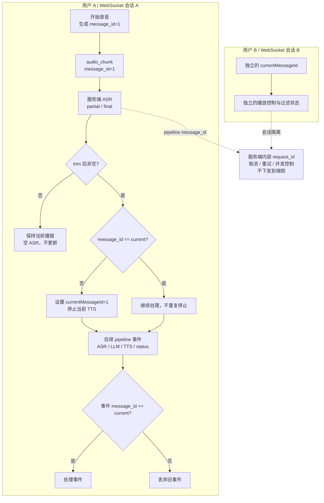

# message_id 驱动的 ASR 打断与结果过滤实现计划

> 状态：已归档

> **给执行者：** 按任务逐项执行本计划。每个任务都需要先写失败测试，再实现最小代码并验证。

**目标：** 让 `message_id` 成为 ASR、LLM、TTS 和 pipeline 状态事件唯一的端侧关联标识；每个 WebSocket 会话只维护一个当前有效 ID，首次收到新 ID 的非空 ASR 时停止播报，之后丢弃其它 ID 的 pipeline 结果。

**架构：** 服务端继续在内部使用 `request_id` 表示一次处理尝试，用于取消、重试和并发控制，但不把它放入 WebSocket 下行 pipeline 事件或端侧事件类型。每个 `VoiceSession` 将同一个 pipeline 的 `message_id` 贯穿 ASR、LLM、TTS、状态和错误事件。每个端侧连接只保存一个 `currentMessageId`：收到不同 ID 的非空 ASR 时更新它并停止播报；此后只处理匹配当前 ID 的事件。

**技术栈：** Rust workspace（`voice-proto`、`voice_server`）、TypeScript/React（`voice_desktop`）、静态浏览器端、MessagePack、Vitest、Cargo 测试。

**依据规范：** `docs/superpowers/specs/2026-09-01-voice-llm-selection-baseline.md` 第 5.4.1 节。

**流程图：**



## 全局约束

- 一句话用户输入只有一个 `message_id`；该轮所有音频帧和 pipeline 输出都复用它。
- `request_id` 只存在于服务端内部，不能出现在 WebSocket 下行 pipeline 事件和端侧事件类型中。
- ASR 文本为空或只有首尾空白时，不能停止播报。
- 第一条 `trim()` 后非空、且 ID 不同于当前 ID 的 ASR 事件，必须停止当前播报并成为新的当前 ID。
- 当前 ID 建立后，只处理匹配该 ID 的 ASR、LLM、TTS、状态和 pipeline 错误；`session_ack` 等连接级事件继续处理。
- 客户端状态必须绑定到具体连接/会话，不能跨用户共享。

## 任务一：更新协议和服务端 pipeline

**文件：**

- 修改：`crates/voice-proto/src/lib.rs`
- 修改：`crates/voice_server/src/session/pipeline.rs`
- 修改：`crates/voice_server/src/session/mod.rs`
- 修改：`crates/voice_server/src/live_asr/mod.rs`
- 测试：`crates/voice-proto/src/lib.rs` 内测试
- 测试：`crates/voice_server/src/session/pipeline.rs` 内测试

**接口约束：**

- `AsrPartial`、`LlmDelta`、`TtsAudio`、`AgentStatus` 必须包含 `message_id: String`，删除 `request_id`。
- `Error` 使用 `message_id: Option<String>`：有值表示 pipeline 错误，按 ID 过滤；无值表示连接级错误。
- 上行音频的 `message_id` 继续放在消息 envelope 中，`AudioChunk` 枚举不重复增加字段。
- 服务端函数可以接收内部 `request_id` 做取消和指标，但序列化时不得输出。

- [ ] **步骤 1：先写失败的协议测试**

增加 `AsrPartial`、`LlmDelta`、`TtsAudio`、`AgentStatus` 的 `message_id` 编解码测试，并增加序列化结果不包含 `request_id` 的测试。

- [ ] **步骤 2：运行测试确认失败**

运行：`cargo test -p voice-proto`

预期：失败，原因是 ASR 没有 `message_id`，现有 pipeline 事件仍会序列化 `request_id`。

- [ ] **步骤 3：修改协议定义**

为 pipeline 下行事件增加必填 `message_id`，删除 `request_id` 和兼容性默认值。将 `Error` 改为 `message_id: Option<String>`。将 `PlaybackStarted` 改为使用 `message_id`，不再让端侧发送服务端生成的 `request_id`。

- [ ] **步骤 4：贯穿服务端发送路径**

给每个 ASR partial/final、AgentStatus、LLM delta、TTS 音频和 pipeline 错误填入 pipeline 的 `message_id`。`request_id` 继续用于服务端取消、重试和并发控制，但不进入下行 payload。重试复用原 `message_id`，只在服务端内部生成新的尝试 ID。

- [ ] **步骤 5：运行 Rust 测试**

运行：`cargo test -p voice-proto && cargo test -p voice_server`

预期：通过；pipeline 测试确认所有事件带正确 `message_id`，且下行事件不暴露 `request_id`。

- [ ] **步骤 6：提交协议改动**

运行：`git add crates/voice-proto/src/lib.rs crates/voice_server/src/session/pipeline.rs crates/voice_server/src/session/mod.rs crates/voice_server/src/live_asr/mod.rs && git commit -m "feat: 使用 message_id 关联 pipeline 事件"`

## 任务二：改造 React 客户端

**文件：**

- 修改：`voice_desktop/src/types/voice-protocol.ts`
- 修改：`voice_desktop/src/services/voice-server-client.ts`
- 修改：`voice_desktop/src/features/conversation/ConversationPage.tsx`
- 修改：`voice_desktop/src/features/conversation/conversation-store.ts`
- 测试：`voice_desktop/tests/voice-server-client.test.ts`
- 测试：`voice_desktop/tests/conversation-store.test.ts`

**接口约束：**

- ASR、LLM、TTS、AgentStatus 事件暴露 `message_id: string`。
- `VoiceEvent` 中删除所有 `request_id` 字段。
- `VoiceServerClient` 只维护一个 `currentMessageId`，删除 request-ID 播放失效 API。

- [ ] **步骤 1：先写失败的端侧测试**

覆盖：ASR partial/final 保留 `message_id`；LLM/TTS/status 保留 `message_id`；当前 ID 建立后不同 ID 的事件被忽略；空 ASR 不改变当前 ID；新 ID 的非空 ASR 停止一次并更新当前 ID；同 ID 后续事件不重复停止。

- [ ] **步骤 2：运行测试确认失败**

运行：`npm test -- voice_desktop/tests/voice-server-client.test.ts voice_desktop/tests/conversation-store.test.ts`

预期：失败，原因是当前端侧使用 `request_id` 和 Set 去重。

- [ ] **步骤 3：实现事件映射和 ID 过滤**

映射所有 pipeline 事件的 `message_id`。在每个客户端实例中，当前 ID 建立后丢弃其它 ID 的 pipeline 事件；`session_ack` 和无 ID 的连接级错误继续处理。连接、手动打断、停止和关闭时清空 `currentMessageId`。

- [ ] **步骤 4：实现单 ID ASR 打断**

删除 Set。处理 ASR 时先执行 `trim()` 判断；文本非空且 `messageId !== currentMessageId` 时，先更新当前 ID，再停止播放器。React 层不读取、不暴露 `request_id`。

- [ ] **步骤 5：运行 TypeScript 验证**

运行：`npm test -- voice_desktop/tests/voice-server-client.test.ts voice_desktop/tests/conversation-store.test.ts && npm run typecheck`

预期：通过。

- [ ] **步骤 6：提交 React 改动**

运行：`git add voice_desktop/src/types/voice-protocol.ts voice_desktop/src/services/voice-server-client.ts voice_desktop/src/features/conversation/ConversationPage.tsx voice_desktop/src/features/conversation/conversation-store.ts voice_desktop/tests/voice-server-client.test.ts voice_desktop/tests/conversation-store.test.ts && git commit -m "feat: 按 message_id 过滤端侧事件"`

## 任务三：改造静态浏览器端

**文件：**

- 修改：`crates/voice_server/static/app.js`
- 修改：`crates/voice_server/static/asr_realtime.js`
- 测试：静态客户端行为测试，以及 Node 语法检查

**接口约束：**

- 每个静态页面/会话只保存一个 `currentMessageId`。
- ASR、LLM、TTS、AgentStatus 和 pipeline 错误处理器对不匹配的 ID 直接返回；无 ID 的连接级错误继续处理。

- [ ] **步骤 1：增加静态行为测试**

覆盖空 ASR、首个非空 ID、同 ID 的 partial/final、旧 ID 迟到输出和无 ID 连接错误；确认只有新 ID 的首个非空 ASR 会停止播报。

- [ ] **步骤 2：实现单 ID 状态**

删除 `stoppedAsrRequestIds` 和 request tracker 的 pipeline 过滤逻辑，在现有页面生命周期中设置、重置 `currentMessageId`，并让所有 pipeline 事件处理器使用同一过滤函数。

- [ ] **步骤 3：运行静态代码检查**

运行：`node --check crates/voice_server/static/app.js && node --check crates/voice_server/static/asr_realtime.js`

预期：通过。

- [ ] **步骤 4：提交静态端改动**

运行：`git add crates/voice_server/static/app.js crates/voice_server/static/asr_realtime.js && git commit -m "feat: 按 message_id 过滤静态端事件"`

## 任务四：会话隔离和完整回归

**文件：**

- 测试：服务端 session 测试和端侧测试
- 检查：`docs/superpowers/specs/2026-09-01-voice-llm-selection-baseline.md` 与实现保持一致

- [ ] **步骤 1：增加跨会话隔离测试**

验证两个独立的 `VoiceServerClient` 各自维护 `currentMessageId` 和播放状态；验证两个 `VoiceSession` 即使使用相同的 `message_id`，也不会共享取消状态或过滤状态。

- [ ] **步骤 2：运行完整验证**

运行：

```bash
cargo test -p voice-proto
cargo test -p voice_server
npm test
npm run typecheck
npm run build
node --check crates/voice_server/static/app.js
node --check crates/voice_server/static/asr_realtime.js
git diff --check
```

预期：全部通过。只对本次修改的 Rust 文件执行格式化，不格式化无关文件。

- [ ] **步骤 3：提交文档和集成验证结果**

运行：`git add docs/superpowers/specs/2026-09-01-voice-llm-selection-baseline.md docs/superpowers/plans/archive/2026-09-02-message-id-asr-filtering.md && git commit -m "docs: 明确 message_id 过滤规范"`
