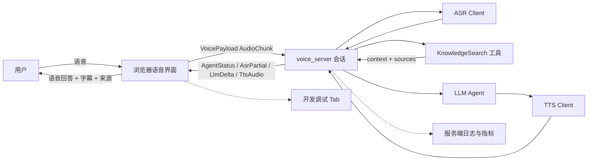
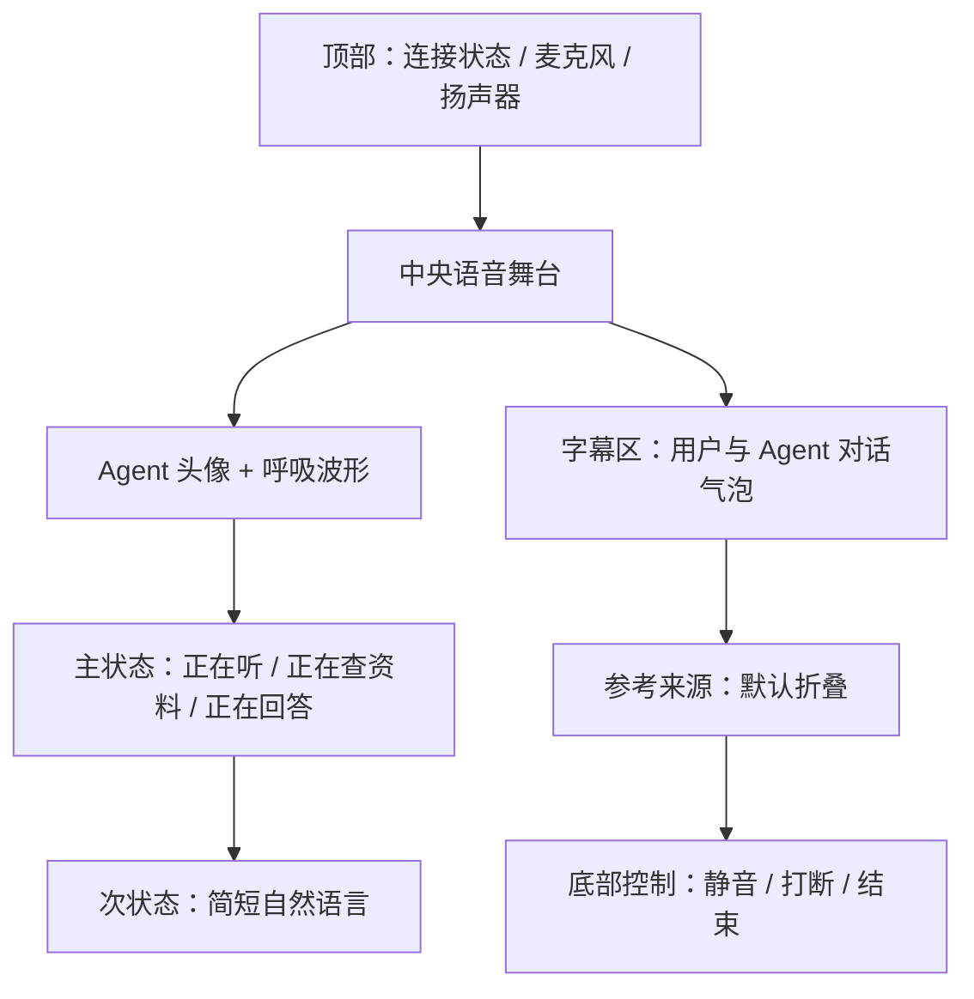
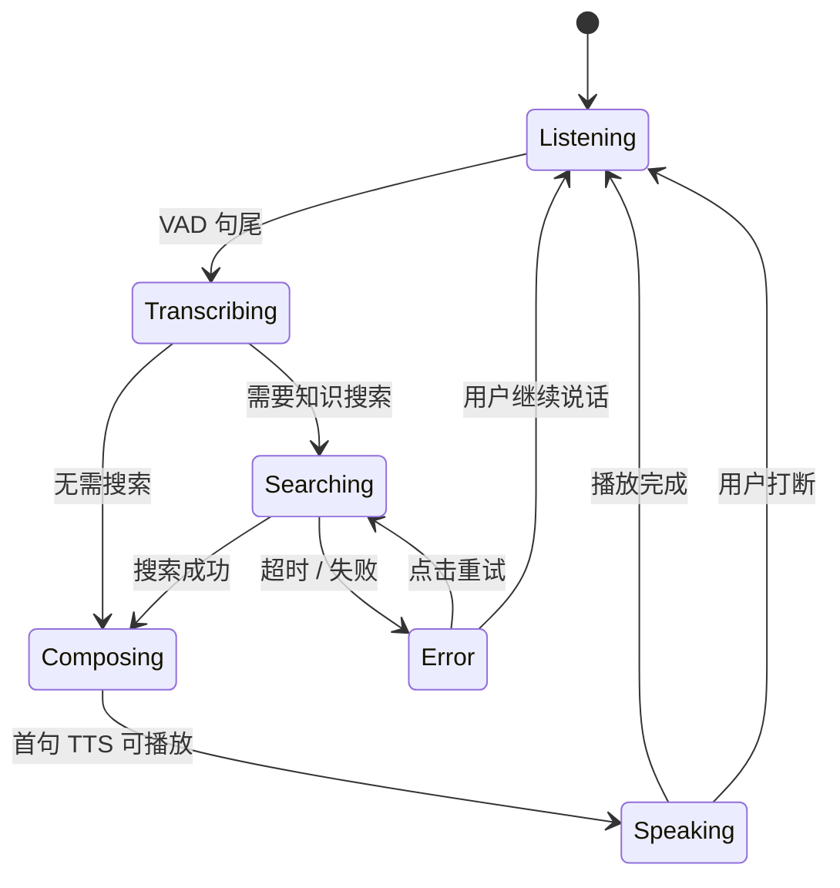
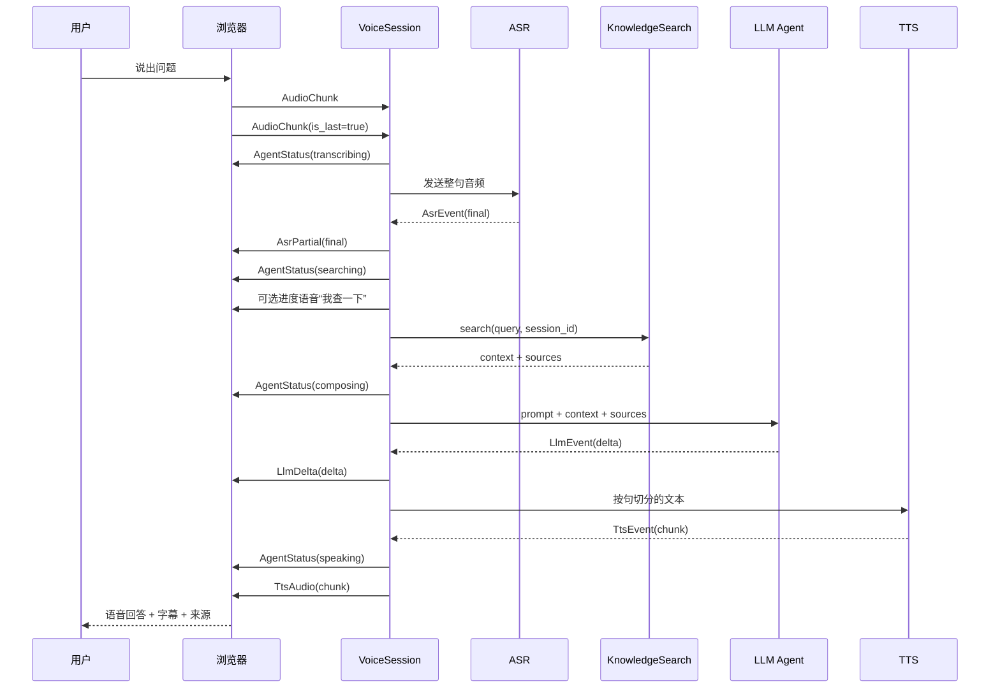
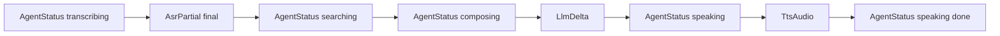
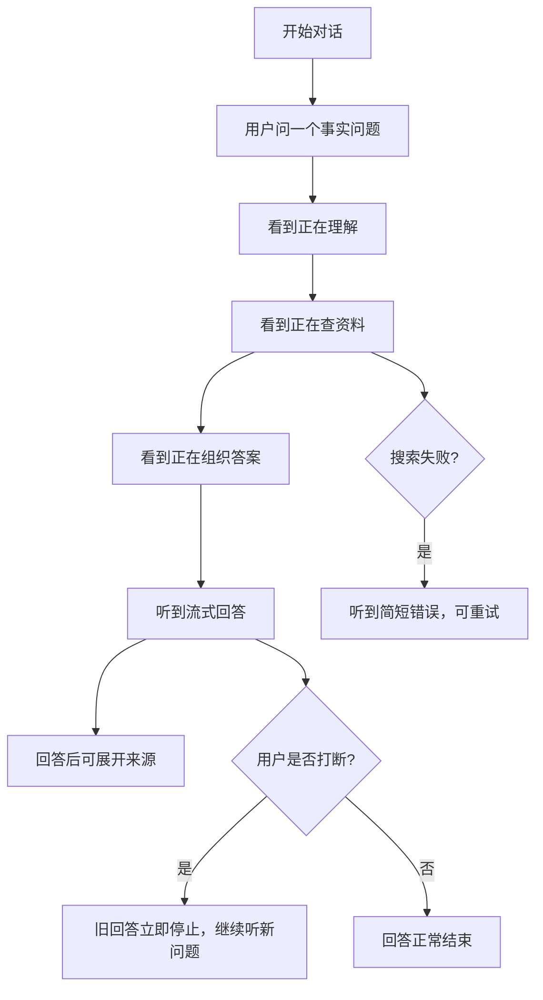

# 语音知识问答 Agent 设计

**日期**：2026-08-27  
**状态**：Phase 1/2 已实现，真实知识搜索待后续接入  
**适用范围**：`voice-ai` 浏览器端终端用户模式

## 1. 背景与目标

当前项目已经跑通浏览器端的语音链路：

```text
浏览器麦克风 -> ASR -> LLM -> TTS -> 浏览器播放
```

现有主页面同时承担终端对话和 ASR/LLM/TTS 单能力验证，适合开发调试，但不适合作为普通用户使用的知识问答 Agent。当前 `VoicePayload` 只表达 `AsrPartial`、`LlmDelta` 和 `TtsAudio`，前端无法准确知道服务端正在搜索资料、组织答案还是处理错误。

本设计的目标是：

1. 将主页面收敛为面向普通用户的语音知识问答体验。
2. 对用户展示可理解的行动状态，但不暴露原始思维链、Prompt、工具参数或原始 JSON。
3. 增加只读知识搜索工具，为后续 RAG、MCP 或外部搜索 provider 留出接口。
4. 保留现有 ASR/LLM/TTS 事件和音频播放逻辑，降低迁移风险。
5. 支持用户打断、工具超时、搜索失败和重试。

非目标：

- 本阶段不实现通用多 Agent 编排器。
- 本阶段不做写操作工具（发消息、下单、删除、修改数据等）。
- 本阶段不向用户朗读完整思考过程或完整搜索结果。
- 本阶段不替换已有 ASR、LLM、TTS provider。

## 2. 设计原则

### 2.1 暴露行动，不暴露思考链

用户需要知道 Agent 是否仍在工作、正在做什么、何时完成；不需要听到内部推理步骤。服务端只发送白名单状态和短文案，前端不自行拼接技术细节。

### 2.2 语音优先，视觉补充

重要结论通过语音输出；阶段状态通过头像、波形、字幕和简短状态文字补充。来源、耗时和错误详情放在界面中，不打断主回答。

### 2.3 兼容现有链路

新增 Agent 状态事件，不修改既有 `AsrPartial`、`LlmDelta`、`TtsAudio` 的语义。旧客户端忽略未知事件或继续使用旧事件时，仍能完成基本语音对话。

### 2.4 可中断、可恢复

每轮请求使用 `request_id` 关联 ASR、搜索、LLM、TTS 事件。新一轮有效语音或显式打断会取消旧请求并清空待播放音频。

## 3. 方案选择

### 3.1 备选方案

| 方案 | 说明 | 优点 | 缺点 |
| --- | --- | --- | --- |
| A. 前端推断 | 根据现有 ASR/LLM/TTS 事件猜测状态 | 改动最少 | 无法准确表达“正在搜索”，多工具时容易错乱 |
| B. 服务端显式状态事件 | 服务端在阶段边界发送安全状态事件 | 状态准确、协议清晰、可观测、易扩展 | 需要扩展协议和 pipeline |
| C. 独立 telemetry 通道 | 另开 WebSocket/HTTP 通道传递调试事件 | 调试信息最完整 | 终端用户场景过重，需维护第二条连接 |

### 3.2 决策

采用 **B：服务端显式状态事件**。

原因是当前项目已经有稳定的语音 WebSocket 和会话取消机制，显式状态可以沿用同一连接传输，不增加连接管理复杂度；同时将用户安全状态和内部日志分开，避免把调试数据误推给终端用户。

## 4. 总体架构



### 4.1 服务端职责

- 接收并维护现有语音会话。
- 在 ASR、搜索、LLM、TTS 阶段发送 `AgentStatus`。
- 调用只读 `KnowledgeSearch` 工具。
- 将搜索上下文和来源交给 LLM。
- 通过 `CancellationToken` 取消旧请求。
- 对错误向用户发送简短可理解的状态，对日志保留详细错误。

### 4.2 浏览器职责

- 采集 PCM、执行现有 VAD、发送音频。
- 渲染 Agent 状态和字幕。
- 播放 TTS 队列并处理用户打断。
- 展示来源摘要和重试入口。
- 不解析或展示模型内部推理、工具原始参数和原始响应。

## 5. 用户体验设计

### 5.1 主界面布局



主界面只保留用户完成任务所需的内容。ASR、LLM、TTS 单能力验证继续保留在开发入口中，但不作为终端用户默认首页的视觉重点。

### 5.2 状态文案

| 内部阶段 | 用户看到的主状态 | 可选次状态 | 是否播报 |
| --- | --- | --- | --- |
| `idle` | 准备就绪 | 点击开始对话 | 否 |
| `listening` | 正在听 | 请直接说话 | 否 |
| `transcribing` | 正在理解 |  | 否 |
| `searching` | 正在查资料 | 我查一下相关信息 | 工具前最多一句 |
| `composing` | 正在组织答案 | 我整理一下 | 通常否 |
| `speaking` | 正在回答 | 可随时打断 | 是最终回答 |
| `error` | 暂时遇到问题 | 可重试 | 简短错误提示 |

状态文案由服务端枚举或白名单模板生成，不能直接使用模型自由生成的句子。

### 5.3 语音播报策略



规则：

- 不播报 `transcribing` 和原始“思考中”。
- `searching` 只在预期有可感知等待时播报一次“我查一下”。
- 工具耗时较长时可以播放轻微 typing/ambient 音；短调用不播放，避免噪声。
- 不朗读搜索关键词、URL、工具参数、JSON 和内部错误栈。
- `speaking` 只播放最终答案，支持 barge-in。

### 5.4 来源展示

回答完成后，在字幕下方显示一个可折叠的“参考来源”区域，每条来源只展示文本信息，包括：

- 标题
- 来源站点或知识库名称
- 可选更新时间
- 不提供外部网页跳转；如需详情，由 Agent 在后续对话中用自然语言解释

语音默认不逐条读 URL。用户说“来源是什么”时，Agent 可以用自然语言概括来源并在视觉区域展开详情。

## 6. 端到端数据流



## 7. 协议设计

### 7.1 新增 `AgentStatus`

建议在 `crates/voice-proto/src/lib.rs` 增加：

```rust
#[derive(Clone, Serialize, Deserialize, Debug)]
#[serde(rename_all = "snake_case")]
pub enum AgentPhase {
    Listening,
    Transcribing,
    Searching,
    Composing,
    Speaking,
    Error,
}

AgentStatus {
    session_id: String,
    phase: AgentPhase,
    /// 由服务端白名单生成，前端可直接显示
    label: String,
    /// 如 "knowledge_search"；无工具时为 None
    tool: Option<String>,
    /// 关联一轮用户请求，避免旧事件污染新一轮 UI
    request_id: u64,
    /// 阶段是否结束
    done: bool,
}
```

字段约束：

- `label` 只能来自服务端模板，不接受模型原文。
- `tool` 只使用稳定的工具标识，不包含调用参数。
- `request_id` 在服务端生成，前端只接受当前请求或最新请求的事件。
- 旧客户端忽略该新 variant 时，既有 ASR/LLM/TTS 流仍可工作。

为避免旧轮次的流式事件迟到后覆盖新状态，`AsrPartial`、`LlmDelta`、`TtsAudio` 也增加可选 `request_id` 字段。旧客户端缺少该字段时按 `0` 解码；新客户端以当前 request id 过滤事件。

### 7.2 事件顺序



事件不是严格一对一的：LLM 和 TTS 仍然可以流式产生多个事件；状态事件用于表达阶段边界，不替代音频和文本数据。

### 7.3 取消语义

当新一轮有效 ASR final 到达，服务端：

1. 取消旧 `request_id` 对应的 LLM/TTS/工具任务。
2. 不再发送旧请求的后续事件。
3. 前端丢弃旧请求的 TTS 队列和未完成状态。
4. 新请求从 `transcribing` 或 `searching` 重新开始。

## 8. 知识搜索工具抽象

### 8.1 接口

```text
KnowledgeSearch.search(
    session_id: &str,
    query: &str,
    cancel: CancellationToken,
) -> Result<SearchResult, SearchError>
```

其中：

```text
SearchResult {
    context: String,
    sources: Vec<Source>
}

Source {
    title: String,
    publisher: String,
    url: Option<String>,
    updated_at: Option<String>
}
```

### 8.2 工具边界

工具只负责检索和规范化结果，不负责生成最终答案。LLM 负责：

- 根据问题和检索上下文组织答案。
- 在证据不足时明确说明不确定性。
- 使用简洁、适合语音播放的句子。

第一版不接入真实知识库或外部搜索实现，但保留 `KnowledgeSearch` trait、`SearchResult` 和来源数据结构，使用 mock/空实现完成协议、状态和 UI 联调。后续可按以下顺序接入 provider：

1. `MockKnowledgeSearch`：开发和自动化测试。
2. 本地知识库/RAG：私有化部署的首选实现。
3. 外部搜索或 MCP：需要网络和权限治理时再接入。

## 9. 错误与降级

| 场景 | 用户体验 | 服务端行为 |
| --- | --- | --- |
| 搜索超时 | “我暂时没查到相关资料，要不要再试一次？” | 发送 `AgentStatus(error)`，保留可重试 request |
| 搜索无结果 | “我没有找到足够可靠的资料。” | 不伪造来源，可询问用户缩小范围 |
| LLM 失败 | “回答生成失败，请再说一次。” | 取消当前 TTS，记录 provider 错误 |
| TTS 失败 | 视觉字幕仍保留，提示“语音播放失败” | 可允许用户点击重播文本 |
| 用户打断 | 立即停止旧语音 | 取消旧 request，回到 Listening |
| WebSocket 断开 | 显示“连接已断开” | 清理 session 和进行中的任务 |

详细错误写入 tracing 日志；发送给浏览器的 message 必须经过用户可读化处理。

## 10. 代码落点

### 10.1 协议与服务端

- `crates/voice-proto/src/lib.rs`
  - 增加 `AgentPhase` 和 `AgentStatus`。
  - 增加 round-trip 测试。
- `crates/voice_server/src/events.rs`
  - 增加搜索结果和来源的内部类型（如当前模块边界需要）。
- `crates/voice_server/src/agent/`
  - 新增 `knowledge_search.rs`，定义 trait、错误和 mock。
- `crates/voice_server/src/session/pipeline.rs`
  - 在 ASR final、工具开始/结束、LLM、TTS 边界发送 `AgentStatus`。
  - 接入 request_id 和取消传播。
- `crates/voice_server/src/config.rs`
  - 增加搜索 provider 的最小配置；默认使用 mock 或关闭。

### 10.2 浏览器

- `crates/voice_server/static/index.html`
  - 主 Tab 改为终端用户对话布局。
  - 增加来源区域和错误重试入口。
- `crates/voice_server/static/app.js`
  - 增加 Agent 状态映射和 request_id 过滤。
  - 沿用现有 TTS 播放队列和 barge-in 逻辑。
- `crates/voice_server/static/style.css`
  - 增加状态动画、字幕、来源列表和移动端布局。
- 现有 `tab_*.js`
  - 继续作为开发调试入口，不与终端主流程耦合。

## 11. 测试与验收

### 11.1 服务端测试

- `AgentStatus` 编解码 round-trip。
- 正常事件顺序：transcribing → searching → composing → speaking。
- 不需要搜索时跳过 searching。
- 搜索超时、无结果和 provider 错误映射为用户安全错误。
- 新 request 取消旧 request，旧 request 不再发送 TTS。
- 搜索 context 和 sources 正确注入 LLM，且不写入不必要的敏感工具参数。

### 11.2 浏览器测试

- 状态文案与状态事件一一映射。
- 旧 request 的延迟事件不会覆盖新 request 的状态。
- 用户打断能清空 TTS 队列并回到 Listening。
- 来源区域默认折叠，展开后不遮挡控制按钮。
- 断线、重试和移动端窄屏下无重叠布局。

### 11.3 验收场景



## 12. 分阶段交付

### Phase 1：用户模式外壳

- 已完成：主页面增加终端用户语音舞台、状态文案、字幕、来源占位区和错误状态。
- 已完成：通过“开发模式”入口保留 ASR/LLM/TTS 调试页面。
- 已完成：响应式布局和用户模式/开发模式 hash 切换。

### Phase 2：显式状态协议

- 已完成：增加 `AgentStatus` 和兼容的流式事件 `request_id`。
- 已完成：服务端在理解、组织答案、回答和错误边界发送状态。
- 已完成：前端按 `request_id` 过滤迟到事件，并在打断时清空旧 TTS。

### Phase 3：知识搜索

- 已完成接口预留：`KnowledgeSearch` trait、`SearchResult`、`Source` 和 `NoopKnowledgeSearch`。
- 未实现真实知识库 provider；第一版默认不联网、不发送 `Searching` 状态。
- 来源文本渲染入口已预留，检索 context 注入将在 provider 接入时完成。

### Phase 4：体验和生产化

- Web Audio 无缝排程，减少 TTS chunk 间隙。
- 增加延迟、成功率、取消率和搜索命中率指标。
- 增加权限、内容审核、限流和多租户隔离。

## 13. 已确认决策

1. **第一版知识库**：暂不实现本地 RAG 或外部搜索，先保留 `KnowledgeSearch` 接口和数据结构，使用 mock/空实现完成联调。
2. **开发入口**：终端用户主界面保留简洁模式；ASR、LLM、TTS 等调试页面通过“开发模式”入口进入，不作为默认首页内容。
3. **来源展示**：只展示来源文本（标题、站点、可选更新时间），不提供外部网页跳转。
4. **语言策略**：第一版固定使用中文。协议保留 `language` 字段，状态文案采用按语言组织的映射表，后续可增加英文等语言而不改变 Agent 状态模型。
